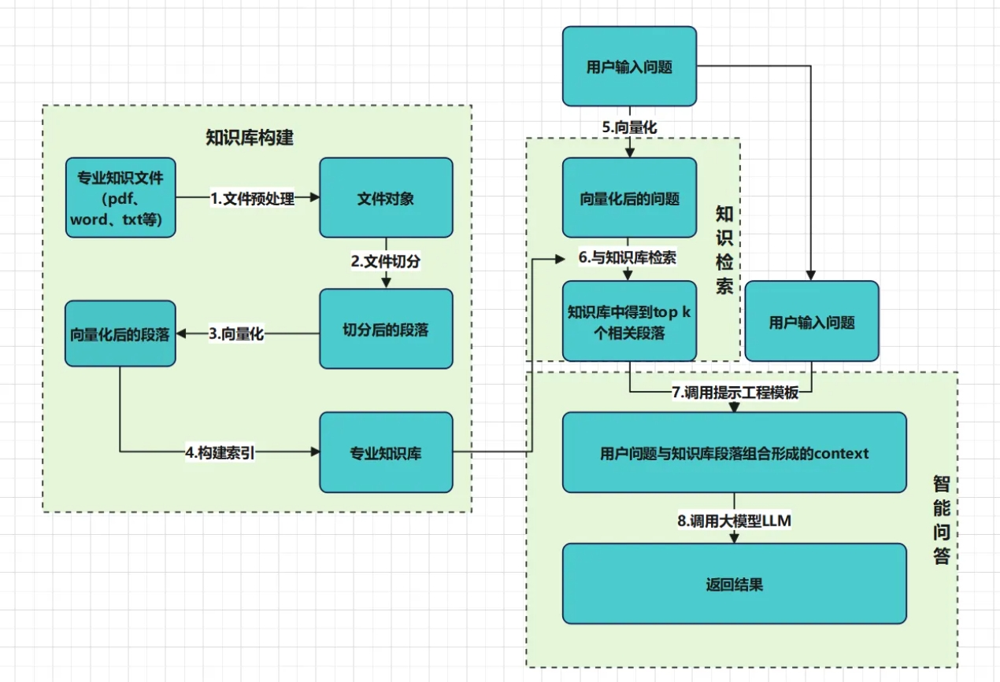

# Hands on TinyRAG

## 什么是RAG？

LLM会产生误导性的 “幻觉”，依赖的信息可能过时，处理特定知识时效率不高，缺乏专业领域的深度洞察，同时在推理能力上也有所欠缺。

正是在这样的背景下，检索增强生成技术（Retrieval-Augmented Generation，RAG）应时而生，成为 AI 时代的一大趋势。

RAG 通过在语言模型生成答案之前，先从广泛的文档数据库中检索相关信息，然后利用这些信息来引导生成过程，极大地提升了内容的准确性和相关性。RAG 有效地缓解了幻觉问题，提高了知识更新的速度，并增强了内容生成的可追溯性，使得大型语言模型在实际应用中变得更加实用和可信。

此仓库用于学习大模型RAG的相关内容，目前为手搓实现，主要是llama-index和langchain不太好魔改。此仓库可以方便看论文的时候，实现一些小的实验。以下为本仓库的RAG代码目录结构。

```
├─data #存放原始数据
├─images
├─RAG #存放RAG核心代码
├─storage #存放chunks embeddings后的数据
└─tutorial
    ├─01.如何调用大模型API
    ├─02.RAG介绍
    ├─03.部署环境准备
    ├─04.知识库构建
    ├─05.基于知识库的大模型问答
    ├─06.改进-用自己的embedding模型
    ├─07.封装镜像对外提供服务
    ├─08.改进-基于Faiss的大模型知识索引构建
    ├─09.改进-使用向量数据库
    │  └─cloud-vectordb-examples
    └─10.前端构建
```


以下为所构思的RAG实现过程，这里面主要包括包括三个基本步骤：

1. 索引 — 将文档库分割成较短的 chunks，并对chunks使用embedding模型构建知识库。

2. 检索 — 根据问题与知识库中chunks 的相似度检索相关文档片段。

3. 生成 — 以检索到的chunks加上问题，输入llm生成答案。

<div align="center">
    
</div>


# QuickStrat

安装依赖，需要 Python 3.10 以上版本。

```bash
pip install -r requirements.txt
```


构建知识库代码如下：

```python
from RAG.VectorBase import VectorStore
from RAG.utils import ReadFiles
from RAG.LLM import OpenAIChat, InternLMChat, GLM4Chat
from RAG.Embeddings import JinaEmbedding, ZhipuEmbedding

docs = ReadFiles('../../data/github_data').get_content(min_token_len=600, max_token_len=1800, cover_content=150) # 获得data目录下的所有文件内容并分割
vector = VectorStore(docs)
embedding = ZhipuEmbedding() # 创建Zhipu EmbeddingModel
vector.get_vector(EmbeddingModel=embedding)
vector.persist(path='../../storage/github_data') # 将向量和文档内容保存到storage目录下，下次再用就可以直接加载本地的数据库

```


基于知识库问答代码如下：

```python
from RAG.Embeddings import ZhipuEmbedding
from RAG.FaissVectorBase import FaissVectorStore
from RAG.LLM import GLM4Chat
# 保存数据库之后
from RAG.PaddleEmbedding import PaddleEmbedding
from RAG.VectorBase import VectorStore

vector = VectorStore()

vector.load_vector('../../storage/github_data') # 加载本地的数据库

question = 'Git中的文件有哪几种状态?'

embedding = ZhipuEmbedding()

content = vector.query(question, EmbeddingModel=embedding, k=1)[0]

chat = GLM4Chat()

print(chat.chat(question, [], content))
```

```tutorial```中每一章知识库与检索方式不同，均可通过修改prepare.py（构建知识库）和test.py（基于知识库检索）达到目的。


## 向量化

在这一部分共使用了三种向量化的方法，分别是`zhipu`、`jina`和`openai`。大家可以在`Embedding`文中找到实现的方式。

如果你有兴趣想使用其他的向量模型可以继承`BaseEmbeddings`类，然后实现`get_embedding`方法。

```python
class BaseEmbeddings:
    """
    Base class for embeddings
    """
    def __init__(self, path: str, is_api: bool) -> None:
        self.path = path
        self.is_api = is_api
    
    def get_embedding(self, text: str, model: str) -> List[float]:
        raise NotImplementedError
    
    @classmethod
    def cosine_similarity(cls, vector1: List[float], vector2: List[float]) -> float:
        """
        calculate cosine similarity between two vectors
        """
        dot_product = np.dot(vector1, vector2)
        magnitude = np.linalg.norm(vector1) * np.linalg.norm(vector2)
        if not magnitude:
            return 0
        return dot_product / magnitude
```

## 向量检索

这里未使用任何成熟的数据库，只是简单的使用`Json`保存了文档分割后的片段和对应的向量。大家可以在`VectorBase.py`中找到实现的方式。

在向量检索的时候仅使用`Numpy`进行加速，代码非常容易理解和修改。

```python
def query(self, query: str, EmbeddingModel: BaseEmbeddings, k: int = 1) -> List[str]:
    query_vector = EmbeddingModel.get_embedding(query)
    result = np.array([self.get_similarity(query_vector, vector)
                        for vector in self.vectors])
    return np.array(self.document)[result.argsort()[-k:][::-1]]
```

此外，继承`VectorBase`类，扩展了`FaissVectorBase.py`支持Faiss向量数据库、`ZillizVectorStore.py`支持Milvus向量数据库。


## LLM 模型

这里支持了`openai`模型、`zhipu`模型和`InternLM2`模型，如果想要用其他的模型，大家可以在`LLM`中找到实现的方式。继承以下基类，然后在此基础上进行修改即可。

```python
class BaseModel:
    def __init__(self, path: str = '') -> None:
        self.path = path

    def chat(self, prompt: str, history: List[dict], content: str) -> str:
        pass

    def load_model(self):
        pass
```


# 参考文献

| Name                                                         | Paper Link                                |
| ------------------------------------------------------------ | ----------------------------------------- |
| When Large Language Models Meet Vector Databases: A Survey   | [paper](http://arxiv.org/abs/2402.01763)  |
| Retrieval-Augmented Generation for Large Language Models: A Survey | [paper](https://arxiv.org/abs/2312.10997) |
| Learning to Filter Context for Retrieval-Augmented Generation | [paper](http://arxiv.org/abs/2311.08377)  |
| In-Context Retrieval-Augmented Language Models               | [paper](https://arxiv.org/abs/2302.00083) |
