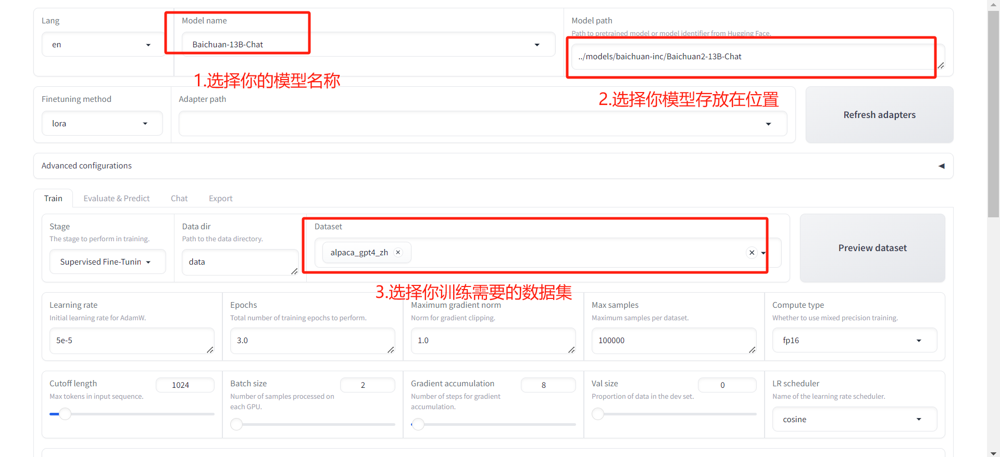
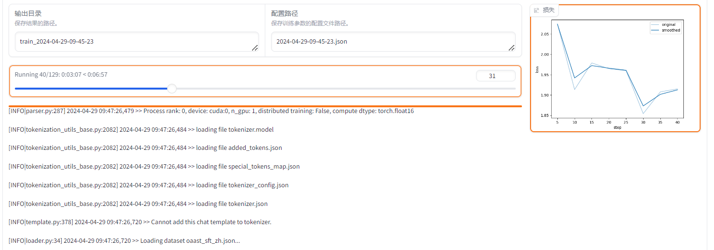

## 1.环境准备


```bash
git clone https://github.com/hiyouga/LLaMA-Factory.git
conda create -n llama_factory python=3.10
conda activate llama_factory
cd LLaMA-Factory
pip install -e .[metrics]
```


## 2.百川13B下载

```
#模型下载
from modelscope import snapshot_download
model_dir = snapshot_download('baichuan-inc/Baichuan2-13B-Chat')
```

默认模型会下载到```~/.cache/modelscope/hub```中，如果需要修改下载目录，可以手动指定环境变量：```MODELSCOPE_CACHE```，modelscope会将模型和数据集下载到该环境变量指定的目录中

更改默认位置：
```
 export MODELSCOPE_CACHE=./models
```

下载完成目录结构：
```
./models/
├── ast_indexer
├── baichuan-inc
│   └── Baichuan2-13B-Chat
│       ├── config.json
│       ├── configuration_baichuan.py
│       ├── configuration.json
│       ├── generation_config.json
│       ├── generation_utils.py
│       ├── model-00001-of-00006.safetensors
│       ├── model-00002-of-00006.safetensors
│       ├── model-00003-of-00006.safetensors
│       ├── model-00004-of-00006.safetensors
│       ├── model-00005-of-00006.safetensors
│       ├── model-00006-of-00006.safetensors
│       ├── modeling_baichuan.py
│       ├── model.safetensors.index.json
│       ├── ms_wrapper.py
│       ├── quantizer.py
│       ├── README.md
│       ├── special_tokens_map.json
│       ├── tokenization_baichuan.py
│       ├── tokenizer_config.json
│       └── tokenizer.model
└── temp
```


 ## 3.训练


### 可视化页面训练

- 启动命令：

```python
export CUDA_VISIBLE_DEVICES=0 # Windows 使用 `set CUDA_VISIBLE_DEVICES=0`
export GRADIO_SERVER_PORT=10099 # Windows 使用 `set GRADIO_SERVER_PORT=7860`
python src/train_web.py # 或 python -m llmtuner.webui.interface
```
截图如下：



**可视化界面目前仅支持单 GPU 训练，请使用命令行接口来进行多 GPU 分布式训练**

- 基于BaiChuan13B SFT 启动命令记录：

```bash
CUDA_VISIBLE_DEVICES=2 python src/train_bash.py \
    --stage sft \
    --do_train True \
    --model_name_or_path ../models/baichuan-inc/Baichuan2-13B-Chat \
    --finetuning_type lora \
    --template baichuan \
    --flash_attn auto \
    --dataset_dir data \
    --dataset oaast_sft_zh \
    --cutoff_len 1024 \
    --learning_rate 5e-05 \
    --num_train_epochs 3.0 \
    --max_samples 100000 \
    --per_device_train_batch_size 2 \
    --gradient_accumulation_steps 8 \
    --lr_scheduler_type cosine \
    --max_grad_norm 1.0 \
    --logging_steps 5 \
    --save_steps 100 \
    --warmup_steps 0 \
    --optim adamw_torch \
    --report_to none \
    --output_dir saves/Baichuan-13B-Chat/lora/train_2024-04-29-09-45-23 \
    --fp16 True \
    --lora_rank 8 \
    --lora_alpha 16 \
    --lora_dropout 0 \
    --lora_target W_pack \
    --plot_loss True

```

预计消耗显存 34G，训练过程如下图



### 命令行训练

